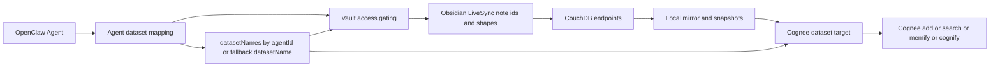

# Protocol Overview

This page is the operator-facing summary of the external protocol assumptions behind `obsidian-livesync-cognee`.

If you are trying to answer these questions, start here:

- which external systems must stay compatible with this plugin?
- which versions did this implementation learn from?
- what breaks first when upstream protocol behavior changes?
- which page should I read next if I need the exact endpoint or document details?

If you need the full request and response reference, read [protocol-compatibility.md](./protocol-compatibility.md).

## What must stay compatible

This plugin depends on compatible behavior from four external systems:

- Obsidian LiveSync for note ids, note shapes, chunked note layout, and path-obfuscation behavior
- Apache CouchDB for `_changes`, direct document reads, conflict inspection, bulk deletion, and compaction
- Cognee for dataset lookup, retrieval search, snapshot ingestion, cognify, memify, and dataset deletion
- Cognee OpenClaw integration conventions for dataset naming and agent-scoped routing

If any of those protocol surfaces drift, this plugin may still start, but sync, writeback, retrieval, or memify behavior can become wrong.

## Recorded source baselines

This implementation was derived from these upstream projects and recorded revisions:

| Source | Upstream | Recorded baseline |
| --- | --- | --- |
| Obsidian LiveSync | [github.com/vrtmrz/obsidian-livesync](https://github.com/vrtmrz/obsidian-livesync) | `0.25.48-1-g09115df` |
| Apache CouchDB | [github.com/apache/couchdb](https://github.com/apache/couchdb) | `3.5.0-440-g0d8340c76` |
| Cognee | [github.com/topoteretes/cognee](https://github.com/topoteretes/cognee) | `v0.5.3-4-gbad3f309` |
| Cognee Integrations | [github.com/topoteretes/cognee-integrations](https://github.com/topoteretes/cognee-integrations) | `openclaw-v2026.2.4-12-g10ac3f3` |
| Cognee OpenClaw integration subtree | [github.com/topoteretes/cognee-integrations](https://github.com/topoteretes/cognee-integrations) | `10ac3f3` |

These are not marketing compatibility claims. They are the source baselines the current implementation was derived from.

## End-to-end flow

Practical reading of the diagram:

1. the current agent resolves to a dataset name
2. that dataset mapping controls which vaults are accessible
3. sync and read behavior depend on LiveSync-compatible CouchDB documents
4. snapshots are staged locally
5. Cognee operations target the resolved dataset

## First things to compare when debugging

Before reporting a sync or retrieval bug, compare these assumptions against your environment:

1. LiveSync still uses compatible note ids and note document shapes.
2. CouchDB still returns compatible `_changes`, `?conflicts=true`, and `?open_revs=all` responses.
3. Cognee still accepts one of the search payload shapes and response envelopes this plugin already supports.
4. Your configured `datasetNames`, default `datasetName`, and vault-side `cognee.datasetName` still line up.

## Common failure buckets

| Symptom | Likely protocol mismatch |
| --- | --- |
| notes stop syncing or disappear | LiveSync note ids or note shapes changed, or `_changes` rows no longer match expectations |
| chunked notes read as empty or unsupported | leaf chunk documents or `children` layout changed |
| conflicts stop resolving correctly | `_conflicts`, `open_revs=all`, or revision deletion semantics changed |
| memify runs but targets the wrong data | dataset naming no longer matches agent-to-vault routing |
| retrieval or deep graph search returns nothing | Cognee search payload or response envelope changed, or dataset lookup stopped resolving |
| purge cannot remove Cognee data | dataset list or dataset delete behavior changed |

## Which page to read next

- Read [protocol-compatibility.md](./protocol-compatibility.md) for the full endpoint list, accepted note shapes, request payload details, and feature-to-endpoint mapping.
- Read [README.md](../README.md) for the operational setup, configuration, and normal workflow guidance.
